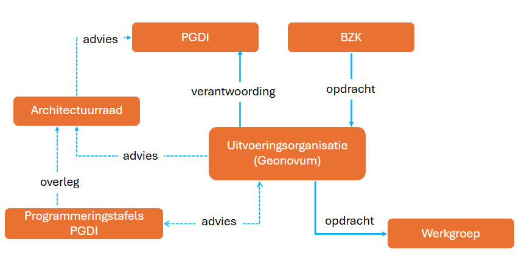

## Wijzigingsproces

De aanleiding voor een wijzigingsproces is gebaseerd op meldingen: de wensen en gevonden fouten in de standaard, die aanleiding zijn om de standaard te vernieuwen. Samen vormen zij het wijzigingsvoorstel. Geonovum neemt als beheerder het initiatief om een wijzigingsproces te starten.

###	Wijzigingenbeheer

Belanghebbenden kunnen meldingen (wijzigingsverzoeken), variërend van wensen tot aanpassing van en fouten in DCAT-AP-NL, indienen bij Geonovum via de [Github repository van DCAT-AP-NL](https://github.com/Geonovum/DCAT-AP-NL30/issues). Wij geven inzicht in de ontvangen en beoordeelde meldingen en bundelen de gehonoreerde verzoeken tot een wijzigingsvoorstel, in het geval we een wijzigingsproces starten voor een nieuwe versie van de standaard. Het wijzigingsprotocol beschrijft het wijzigingsproces en daarmee ook de procedure die het wijzigingsvoorstel doorloopt. 

Ontwikkelingen in de standaarden kunnen om verschillende redenen gewenst zijn, waaronder:
- geconstateerde fout in de standaard;
- wens tot wijziging, uitbreiding of vereenvoudiging uit de praktijk;
- aanpassing van de standaard door internationale ontwikkelingen.

Met behulp van het wijzigingsprotocol wordt de geplande wijziging van de standaard uitgevoerd. In de aanloop naar een wijziging van de standaard bundelt Geonovum de meldingen, verzoeken tot wijziging, in een wijzigingsvoorstel. Het wijzigingsvoorstel vormt de basis voor een werkgroep om een nieuwe versie van de standaard op te stellen. Met behulp van onder andere een publieke consultatie leggen wij de nieuwe versie van de standaard voor aan de praktijk en vragen hun feedback.

### Inzicht in het wijzigingsproces

De meldingen en wijzigingsverzoeken alsook (inter)nationale ontwikkelingen geven aanleiding tot de verdere ontwikkeling voor een standaard. Zij worden gebundeld in een wijzigingsvoorstel. Het wijzigingsprotocol geeft richting aan het wijzigingsproces dat dit wijzigingsvoorstel doorloopt. In onderstaand figuur is de organisatie van het ontwikkelen en beheren van DCAT-AP-NL geschetst.

**Figuur: Organisatiestructuur voor beheer DCAT-AP-NL**

Dit figuur toont de betrokken partijen bij het ontwikkelen en beheren van DCAT-AP-NL. 

De werkgroep beoordeelt de impact van het wijzigingsvoorstel vanuit de inhoudelijke expertise. Dit resulteert in een definitief concept van de nieuwe versie van de standaard. De programmeringstafels en de architectuurraad beoordelen een definitief concept. Als de Architectuurraad (van PGDI) het definitieve concept van een positief advies voorzien gaat het defintieve concept ter goedkeuring naar PGDI.Keurt zij het goed, dan is er een nieuwe standaard. Keurt zij het af, dan gaat het concept terug naar de werkgroep. 
Bij het vaststellen van een nieuwe versie van een standaard stelt PGDI met advies van de architectuurraad en Geonovum vast hoelang een oude versie wordt ondersteund en wanneer een oude versie komt te vervallen. 
PGDI beslist, op advies van de architectuurraad en Geonovum, of zij een vastgestelde standaard voordraagt voor opname op [de pas-toe-of-leg-uit-lijst voor open standaarden](https://www.forumstandaardisatie.nl/open-standaarden). Bij een positief besluit verzorgt Geonovum de voordracht bij het Forum Standaardisatie.
